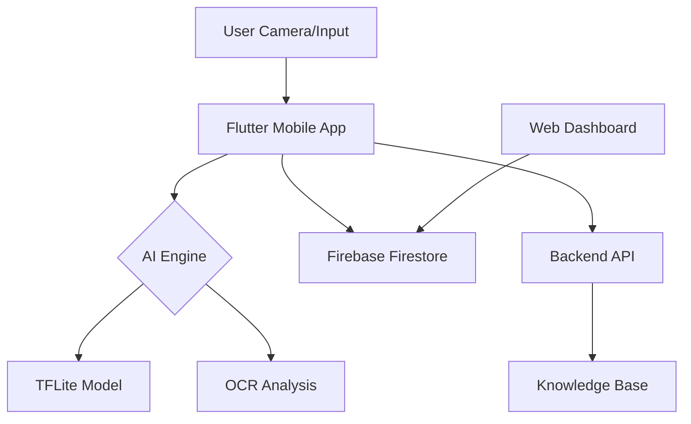

# RecycleEasy: AI-Powered Smart Recycling Assistant
### Team 71 | Final Project Report


## 📋 Table of Contents
- [Executive Summary](#-executive-summary)
- [The Problem](#-the-problem)
- [The Solution: RecycleEasy](#-the-solution-recycleeasy)
- [Key Features](#-key-features)
- [System Architecture](#-system-architecture)
- [Module Breakdown](#-module-breakdown)
- [Tech Stack](#-tech-stack)
- [Installation & Setup](#-installation--setup)
- [Future Roadmap](#-future-roadmap)
- [Team Members](#-team-members)

---

## 🌟 Executive Summary
RecycleEasy is a comprehensive, AI-driven waste management ecosystem designed to bridge the gap between individual waste generation and responsible disposal. By leveraging **Machine Learning (TensorFlow Lite)**, **Computer Vision (OCR)**, and **Cross-Platform Mobile Technology (Flutter)**, the system provides real-time classification of waste items and guides users to the correct disposal methods based on local recycling rules.

## ⚠️ The Problem
In modern urban environments, improper waste segregation is a primary driver of environmental degradation. Users often struggle with:
- **Confusion**: Not knowing which bin to use for specific materials.
- **Complexity**: Local recycling rules varying significantly across regions.
- **Accessibility**: Lack of immediate, reliable information at the point of disposal.

## ✅ The Solution: RecycleEasy
RecycleEasy simplifies recycling through a three-pronged approach:
1. **Identify**: High-accuracy AI classification using the mobile camera.
2. **Inform**: Instant disposal instructions (Bin color, material type, recyclability).
3. **Incentivize**: (Future) Community leaderboards and impact tracking.

---

## 🚀 Key Features
- **AI Camera Scanner**: Real-time waste classification using a custom-trained TFLite model.
- **Interactive Recycling Map**: GPS-based location services to find the nearest recycling centers and drop-off points.
- **Manual Search**: A robust database of materials for quick lookups when scanning isn't possible.
- **Smart Bin Guidance**: Visual cues (Black, Green, Blue bins) based on international and local standards.
- **Multi-Platform Access**: Flutter-based mobile app for on-the-go scanning and a Next.js web dashboard for data management.
- **Multilingual Support**: Inclusive UI catering to diverse user demographics.

---

## 🏗 System Architecture
The project follows a modular architecture ensuring scalability and high performance:



---

## 📦 Module Breakdown

### 📱 Mobile Application (`/mobile_app`)
- **Framework**: Flutter
- **Capabilities**: Firebase Authentication, Firestore Integration, Real-time Camera Feed, Offline Support.
- **UI/UX**: Premium dark-mode interface with minimalist line-art icons and smooth transitions.

### 🧠 AI Engine (`/ai_engine`)
- **Architecture**: MobileNetV2 with Transfer Learning (Custom Head: GlobalAveragePooling2D, Dense 256, Dropout 0.5, Softmax).
- **Performance**: 
    - **Accuracy**: ~95.3% (Top-1 Accuracy).
    - **Validation Loss**: 0.1382.
- **Classes**: Classifies waste into 7 distinct categories:
    - `Cardboard`, `Glass`, `Metal`, `Organic`, `Paper`, `Plastic`, `Trash`.
- **Deployment**: Optimized using **TensorFlow Lite (TFLite)** for on-device mobile inference (low battery & data usage).
- **OCR**: Integrated label detection to identify material types from packaging text.

### 🌐 Web Platform (`/web_platform`)
- **Framework**: Next.js
- **Purpose**: Provides a centralized dashboard for administrators to update recycling rules and monitor system health.

### 🔌 Backend API (`/backend_api`)
- **Framework**: Python (Flask/FastAPI)
- **Role**: Handles complex material mapping and serves as a bridge between the AI engine and the knowledge base.

---

## 🛠 Tech Stack
| Category | Technology |
| :--- | :--- |
| **Frontend** | Flutter, Next.js |
| **Backend** | Python, Firebase Functions |
| **Database** | Cloud Firestore |
| **AI/ML** | TensorFlow Lite, Keras, OpenCV |
| **DevOps** | Git, GitHub Actions |

---

## ⚙️ Installation & Setup

### Prerequisites
- Flutter SDK (latest version)
- Python 3.9+
- Firebase Project setup

### Steps
1. **Clone the Repository**:
   ```bash
   git clone https://github.com/your-repo/RecycleEasy.git
   ```
2. **Mobile App Setup**:
   ```bash
   cd mobile_app/recycle_easy
   flutter pub get
   flutter run
   ```
3. **AI Engine (Notebooks)**:
   - Explore `ai_engine/train_model.ipynb` to see the model training process.

---

## 🗺 Future Roadmap
- [ ] **IoT Integration**: Smart bin sensors to detect fill levels.
- [ ] **Gamification**: Reward points for every item correctly recycled.
- [ ] **Community Hub**: Connecting users with local recycling centers.

---

## 👥 Team Members
- **Parv Upadhyay** (Team Lead) - *Mobile Development & Backend Architecture*
- **Vanshika Goyal** - *AI Engine & Web Platform Development*
- **Sankalp Gupta** - *AI Models & Knowledge Base Management*

---

© 2026 RecycleEasy Team. Developed for the Final Year Project Evaluation.
